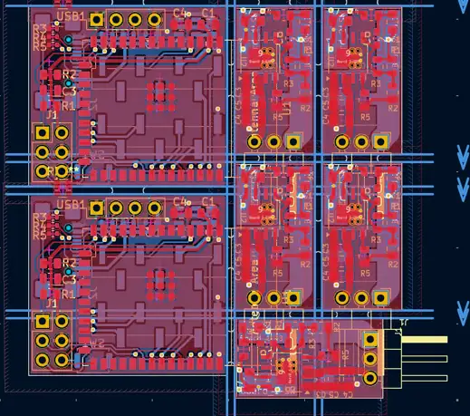

# KiKit Packer

Merge multiple boards into a single file with minimum area to reduce costs when ordering with your PCB manufacturer.

* Works with rectangular shaped boards
* based on [rectangle-packer](https://github.com/Penlect/rectangle-packer)
* finds maximum density packing by offset and 90° rotation
* applies penalty for rotation (prefer layouts with least rotated area)

# Example Output


Input: 2x MCU head + 5x PSU for [Fugu2](https://github.com/fl4p/Fugu2) solar charger 


## How to use

Requirements:
* KiCad
* [KiKit](https://yaqwsx.github.io/KiKit/latest/installation/intro/)


Edit `kikit-packer.py`:
```
input_boards = [
    dict(pcb='Fugu2.kicad_pcb', count=1),
    dict(pcb='psu/buck100.kicad_pcb', count=5),
    ...
]
```
Add your boards to the `input_boards` list.

Then run `kikit panelize`:

```
kikit panelize \
  --layout 'plugin; code: kikit-packer.py.Plugin;' \
    --tabs 'fixed; hwidth: 4mm; vwidth: 4mm' \
    --cuts vcuts \
    --post 'millradius: 1mm' \
  {mainboard}.kicad_pcb combined.kicad_pcb
```

Replace `{mainboard}` with the main PCB file (can be empty).


## Install (macOS)

Create a new virtual environment based on the KiCad one and install requirements:
```
PYTHON=/Applications/KiCad/KiCad.app/Contents/Frameworks/Python.framework/Versions/Current/bin/python3
${PYTHON} -m venv --system-site-packages venv
./venv/bin/pip3 install -r requirements.txt
```

## Install (Linux)

Test if you can import `pcbwnew`:
```
python3 -c "import pcbnew; print(pcbnew._pcbnew)"
```

Create a new virtual environment:
```
PYTHON=python3
${PYTHON} -m venv --system-site-packages venv
./venv/bin/pip3 install -r requirements.txt
```

## Install (Windows)
```
"C:\Program Files\KiCad\8.0\bin\python.exe" -m pip install -r requirements.txt
```


