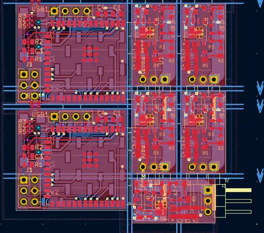

# KiKit Packer

Merge multiple boards into a single file (panel) with minimum area to reduce costs when ordering with your PCB manufacturer.

* Works with rectangular shaped boards
* based on [rectangle-packer](https://github.com/Penlect/rectangle-packer)
* finds maximum density packing by offset and 90° rotation
* applies penalty for rotation (prefer layouts with least rotated area)

## Example Output



Input: 2x MCU head + 5x PSU for [Fugu2](https://github.com/fl4p/Fugu2) solar charger. Please ignore
the [vcuts](https://github.com/fl4p/kikit-packer/issues/1) here.

## Setup

You need to have KiCad with [KiKit](https://yaqwsx.github.io/KiKit/latest/installation/intro/) plugin installed.

Clone this repository into a folder (e.g. `~/dev/`)

```
git clone https://github.com/fl4p/kikit-packer
cd kikit-packer
```

Then install the requirements, according to one of the following sections for macOS, Linux and Windows:


### Install dependencies (macOS)

Create a new virtual environment based on the KiCad one and install requirements:

```
PYTHON=/Applications/KiCad/KiCad.app/Contents/Frameworks/Python.framework/Versions/Current/bin/python3
${PYTHON} -m venv --system-site-packages venv-ki
./venv-ki/bin/pip3 install .
```

### Install dependencies (Linux)

Test if you can import `pcbwnew`:

```
python3 -c "import pcbnew; print(pcbnew._pcbnew)"
```

Create a new virtual environment:

```
PYTHON=python3
${PYTHON} -m venv --system-site-packages venv
./venv/bin/pip3 .
```

### Install dependencies (Windows)

```
"C:\Program Files\KiCad\8.0\bin\python.exe" -m pip install .
```


## How to use
Create a yaml file listing all your boards you want to combine and how many copies you need:

```yaml
boards:
  B1: # used to extraced by kikit annotation from the main board file
    qty: 1
    margin: 2mm      # default = 1mm
  DebugProbe: # not used for idenitification, board in file is extracted
    qty: 2
    filename: debug-probe/debug-probe.kicad_pcb
  Sensor:
    filename: sensor/sensor.kicad_pcb
    qty: 4
```

Here we name this file `probe-and-4sensors.yaml`.
File names in the `.yaml` file are relative to the folder where the `.yaml` is stored.

Then run kikit from shell:

```shell
kikit panelize \
  --layout 'plugin; code: kikit-packer/kikit-packer.py.Plugin; arg:probe-and-4sensors.yaml' \
    --tabs 'fixed; hwidth: 2mm; vwidth: 2mm' \
    --cuts 'mousebites' \
    --post 'millradius: 1mm' \
  main_board.kicad_pcb combined.kicad_pcb
```

The main board command line argument (`main_board.kicad_pcb` here) and output file (`combined.kicad_pcb`) are relative to
the current working directory. The output board will have the same board setup (DRC etc.) as the main board file.
